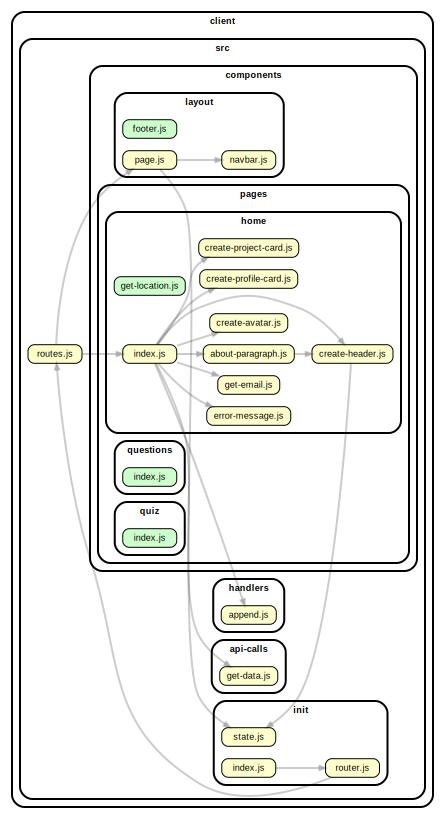

<!-- BEGIN TITLE -->

# DOCS

<!-- END TITLE -->

<!-- BEGIN TREE -->

> [interactive graph](./dependency-graph.html)

<!-- END TREE -->

<!-- BEGIN TOC -->

- api-calls
  - [get-data.js](#clientsrcapi-callsget-datajs)
- components
  - layout
    - [footer.js](#clientsrccomponentslayoutfooterjs)
    - [navbar.js](#clientsrccomponentslayoutnavbarjs)
    - [page.js](#clientsrccomponentslayoutpagejs)
  - pages
    - home
      - [about-paragraph.js](#clientsrccomponentspageshomeabout-paragraphjs)
      - [create-avatar.js](#clientsrccomponentspageshomecreate-avatarjs)
      - [create-header.js](#clientsrccomponentspageshomecreate-headerjs)
      - [create-profile-card.js](#clientsrccomponentspageshomecreate-profile-cardjs)
      - [get-email.js](#clientsrccomponentspageshomeget-emailjs)
      - [get-location.js](#clientsrccomponentspageshomeget-locationjs)
      - [index.js](#clientsrccomponentspageshomeindexjs)
    - questions
      - [index.js](#clientsrccomponentspagesquestionsindexjs)
    - quiz
      - [index.js](#clientsrccomponentspagesquizindexjs)
- handlers
  - [append.js](#clientsrchandlersappendjs)
- init
  - [index.js](#clientsrcinitindexjs)
  - [router.js](#clientsrcinitrouterjs)
  - [state.js](#clientsrcinitstatejs)
- logic
- [routes.js](#clientsrcroutesjs)

---

<!-- END TOC -->

<!-- BEGIN DOCS -->

# /api-calls

<a href="../../client/src/api-calls/get-data.js" id="clientsrcapi-callsget-datajs">../client/src/api-calls/get-data.js</a>

---

# /components

## /layout

<a href="../../client/src/components/layout/footer.js" id="clientsrccomponentslayoutfooterjs">../client/src/components/layout/footer.js</a>

## footer ⇒ <code>HTMLDivElement</code>

The shared footer.

**Returns**: <code>HTMLDivElement</code> - A rendered footer element.

<a href="../../client/src/components/layout/navbar.js" id="clientsrccomponentslayoutnavbarjs">../client/src/components/layout/navbar.js</a>

## navbar ⇒ <code>HTMLDivElement</code>

The shared navbar.

**Returns**: <code>HTMLDivElement</code> - A rendered nav bar element.

<a href="../../client/src/components/layout/page.js" id="clientsrccomponentslayoutpagejs">../client/src/components/layout/page.js</a>

## page ⇒ <code>HTMLDivElement</code>

The page layout component.

**Returns**: <code>HTMLDivElement</code> - A rendered page element.  
**Throws**:

- <code>TypeError</code> When the bodyComponent is not a function or DOM element.

| Param         | Type                                              | Description                           |
| ------------- | ------------------------------------------------- | ------------------------------------- |
| bodyComponent | <code>function</code> \| <code>HTMLElement</code> | The body for the newly rendered page. |

---

## /pages

### /home

<a href="../../client/src/components/pages/home/about-paragraph.js" id="clientsrccomponentspageshomeabout-paragraphjs">../client/src/components/pages/home/about-paragraph.js</a>

<a href="../../client/src/components/pages/home/create-avatar.js" id="clientsrccomponentspageshomecreate-avatarjs">../client/src/components/pages/home/create-avatar.js</a>

<a href="../../client/src/components/pages/home/create-header.js" id="clientsrccomponentspageshomecreate-headerjs">../client/src/components/pages/home/create-header.js</a>

<a href="../../client/src/components/pages/home/create-profile-card.js" id="clientsrccomponentspageshomecreate-profile-cardjs">../client/src/components/pages/home/create-profile-card.js</a>

<a href="../../client/src/components/pages/home/get-email.js" id="clientsrccomponentspageshomeget-emailjs">../client/src/components/pages/home/get-email.js</a>

<a href="../../client/src/components/pages/home/get-location.js" id="clientsrccomponentspageshomeget-locationjs">../client/src/components/pages/home/get-location.js</a>

<a href="../../client/src/components/pages/home/index.js" id="clientsrccomponentspageshomeindexjs">../client/src/components/pages/home/index.js</a>

## home ⇒ <code>HTMLDivElement</code>

The home page.

**Returns**: <code>HTMLDivElement</code> - A rendered home page.

---

### /questions

<a href="../../client/src/components/pages/questions/index.js" id="clientsrccomponentspagesquestionsindexjs">../client/src/components/pages/questions/index.js</a>

## questions ⇒ <code>HTMLDivElement</code>

The questions page.

**Returns**: <code>HTMLDivElement</code> - A rendered questions page.

---

### /quiz

<a href="../../client/src/components/pages/quiz/index.js" id="clientsrccomponentspagesquizindexjs">../client/src/components/pages/quiz/index.js</a>

## quiz ⇒ <code>HTMLDivElement</code>

The quiz page.

**Returns**: <code>HTMLDivElement</code> - A rendered quiz page.

---

---

---

# /handlers

<a href="../../client/src/handlers/append.js" id="clientsrchandlersappendjs">../client/src/handlers/append.js</a>

---

# /init

<a href="../../client/src/init/index.js" id="clientsrcinitindexjs">../client/src/init/index.js</a>

<a href="../../client/src/init/router.js" id="clientsrcinitrouterjs">../client/src/init/router.js</a>

<a href="../../client/src/init/state.js" id="clientsrcinitstatejs">../client/src/init/state.js</a>

---

# /logic

---

<a href="../../client/src/routes.js" id="clientsrcroutesjs">../client/src/routes.js</a>

## routes

Defines the route URLs, names and callbacks.

<!-- END DOCS -->
